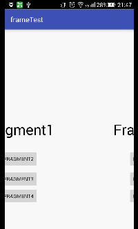

#FragmentStack

>一个封装了启动模式的Fragment便捷使用库,方便构建单Activity+多Fragment轻量级框架。

## 一 为什么要写这个库

1.Fragment创建速度完胜Activity,在长期的开发实践中,明显感觉到Fragment响应速度,内存占用等方面拥有巨大的优势,将页面fragment化有助于提升app流畅度;

2.fragment创建和使用相比Activity更加麻烦,其中,回退栈管理,动画,关闭,隐藏等不便于使用,需要进一步封装提升效率;

3.fragment缺少启动模式,使得管理起来很有难度,很多在Activity上很常见的需求在Fragment使用需要更多更复杂的技巧,不利于快速开发;

## 二 它能为你做什么

1.替代传统的Activity页面,轻量化页面;

2.开启,关闭,动画,回退栈,生命周期回调等操作更加方便,一行代码即可搞定;

3.自带Activity四种启动模式,接管了系统的回退栈,很常见的场景,如 用户中心--->注册用户--->注册成功--->返回原来的用户中心,就可以设置启动模式为singleTask,注册成功后退出当前任务栈,或者设置用户中心singleInstance,直接new创建后再onNewInstance()方法中更新数据即可,框架自动remove上层fragment;

## 三 配置和开始使用

对于如何导入，也是相当的简单，android studio的用户，直接：

然后,在你的项目中,MainActivity继承RootActivity

	public class MainActivity extends RootActivity {

	    @Override
	    protected RootFragment getRootFragment() {
	        return new HomeFragment();
	    }

	    @Override
	    public void onCreateNow(Bundle savedInstanceState) {
	        setAnim(R.anim.next_in, R.anim.next_out, R.anim.quit_in, R.anim.quit_out);
	    }
	}

Fragment继承BaseFragment

	public class HomeFragment extends RootFragment{

	    @Nullable
	    @Override
	    public View onCreateView(LayoutInflater inflater, @Nullable ViewGroup container, @Nullable Bundle savedInstanceState) {
	
	    }
	}

接下来,可以自由方便的使用Fragment了;

## 四 API说明
1.打开一个新的Fragment;

常规方式
	
	open(new Fragment());

带参形式

	open(new Fragment());
	在新Fragment中用Bundle bundle = getArguments();获取

带启动模式形式,支持四种启动模式(实际项目中以singleTask最为实用);

	open(new Fragment1(), null, FragmentStack.STANDARD);
	open(new Fragment1(), null, FragmentStack.SINGLE_TOP);
	open(new Fragment1(), null, FragmentStack.SINGLE_TASK);
	open(new Fragment1(), null, FragmentStack.SINGLE_INSTANCE);

设置页面切换动画
	
	setAnim(R.anim.next_in, R.anim.next_out, R.anim.quit_in, R.anim.quit_out);

进入下一个页面,两个页面的回调,只需重写
	
	private void onNowHidden() {

    }

	private void onNextShow() {

    }

Fragment获取依赖的Activity

	RootActivity root = getRoot();

singleTop,fragment被重复创建的回调
	
	@Override
    public void onNewIntent() {
    }

若需要监听按键事件,只需设置sKeyCallBack

	setKeyCallBack(new KeyCallBack() {
            @Override
            public boolean onKeyDown(int keyCode, KeyEvent event) {
                return false;
            }
        });

使用效果:

	
	